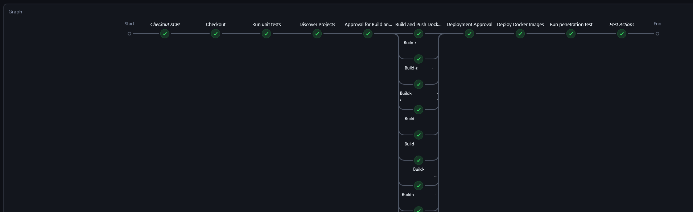
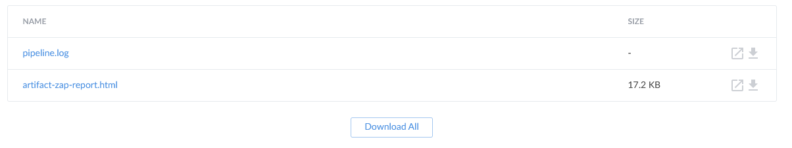
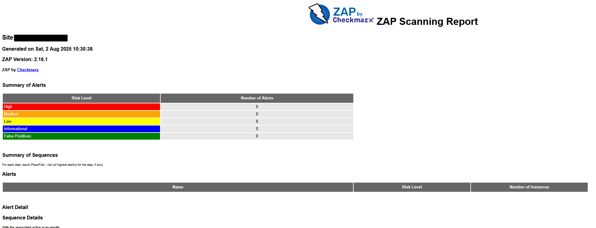
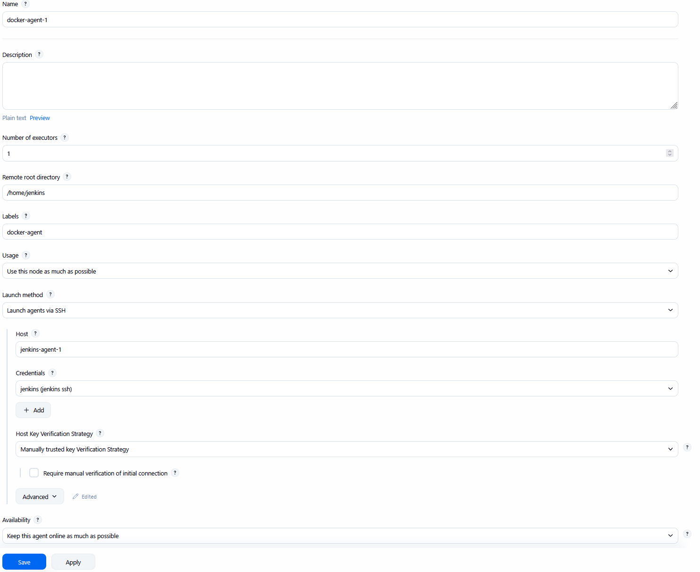

# Jenkins CI/CD

This is a simplified pipeline meant for demo purposes, so feel free it use it as you like.


### Things I would consider when using this configuration:
1. I'm not a security expert, but I wouldn't run the penetration test on a live website as it can take your website down by the hosting provider and would only execute it in staging environment (Sandbox) post deployment.
2. I might use this setup as is with some changes if I don't have other environments like QA and Staging (Single environment => Production)
3. Docker images tags. For release images, I would tag the image using it's semantic release number in addition to `latest`, in this case `latest = latest release number = latest live in production`. 


#### Successful run:

The pipeline should look like this:


Artifacts folder should contain 2 reports (Switch to Blue Ocean view):


Penetration report should look this: 


## Demo Setup

### About the setup
- Build is triggered manually, but you can use webhooks to trigger the pipeline like when pull request is created.
- Both Jenkins controller and agents will be on the same machine and docker network.
- Agents Dockerfile is configured to run .Net 9, Nodejs, AWS CLI in addition to build and push docker images to registry (AWS ECR in the demo)

### Installation

Assuming that you have both Docker and Docker compose installed on the target machine. You can install docker/compose from Docker.com or install applications like Rancher Desktop or any other way you prefer.

#### 1. Create jenkins network

Start by creating the docker network that Jenkins controller and agents will use and communicate over. 
```sh
    docker network create jenkins-network
```

#### 2. Create jenkins controller

1. Navigate to Controller folder, then 

2. Build Controller Dockerfile
```sh
    docker build -t blue-ocean-jdk21 .
```
This will be build the docker image for jenkins controller including additional plugins: blueocean, docker-workflow, json-path-api, ssh-steps, aws-credentials, discord-notifier

3. Execute docker compose to start the controller
```sh
    docker compose up -d
```

4. Open in a browser `http://localhost:8099` and finish Jenkins setup
5. Generate SSH Key and add it to Jenkins (Credential > System > Global Credential > SSH Username with private key)
    - Use the generated private key when adding the "SSH Username with private key", `set the ID = jenkins`
    - Set the generated public key as the JENKINS_AGENT_SSH_PUBKEY in agents docker compose file

#### 3. Create jenkins agents

1. Navigate to Agents folder

2. Build Agents Dockerfile 

```shell
    docker build -t jenkins-agent-jdk21 .
```
This will be build the docker image for jenkins agent

3. Execute docker compose to start the agents
```sh
    docker compose up -d
```

You can adjust the agents configuration in the file like change number of agents, cpu, memory, containers name and so on. The container name will be needed later on when adding nodes in the controller.


```
NOW: If everything is fine, then when you execute `docker ps` in the terminal you should see your controller and the 7 agents running.
```


#### 4. Add docker agents to jenkins Controller

From  Manage Jenkins > Nodes > New Node (Repeat the same thing for all agents)



```
Labels: Is like a pool where agents with the same label exist in, but also agent can be part of multiple pools.
```

